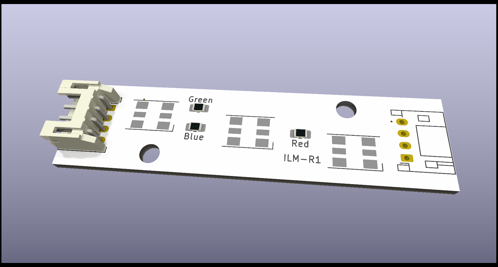

# Maimai-ILM-R1

Reproduction of the ILM-R1 PCB used for lighting in Maimai cabinet.

## BOM

* Inolux_IN-P55TATRGB RGB leds
* 0805 resistors
  * Red: 450 ohms
  * Green: 130 ohms
  * Blue: 150 ohms
